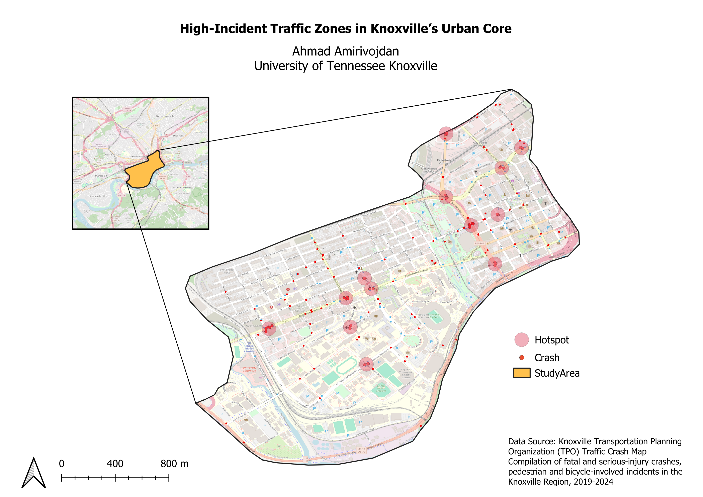

# High-Incident Traffic Zones in Knoxville’s Urban Core

## Abstract

This project investigates high-incident traffic zones in Knoxville’s urban core, encompassing the University of Tennessee (UT) campus, Fort Sanders neighborhood, and downtown Knoxville. By employing the DBSCAN (Density-Based Spatial Clustering of Applications with Noise) algorithm, clusters of traffic incidents were identified and analyzed using QGIS. The study integrates OpenStreetMap as the base map to provide spatial context and visualizations of incident hotspots. The findings highlight key zones for safety interventions and offer actionable insights for urban planning and traffic management.

## Key Features

- **Study Area:** UT campus, Fort Sanders, and Downtown Knoxville.
- **Clustering Method:** DBSCAN algorithm to detect high-density incident zones.
- **Visualization Tool:** QGIS, with OpenStreetMap as the base map.
- **Data Source:** Open Data Portal ([KnoxPlanning Open Data](https://knoxplanning.org/data/open-data)).

## Results

The analysis identified several clusters of incidents near major corridors, intersections, and high-traffic zones. Recommendations for improving safety include infrastructure enhancements and better traffic management strategies tailored to specific hotspots.

